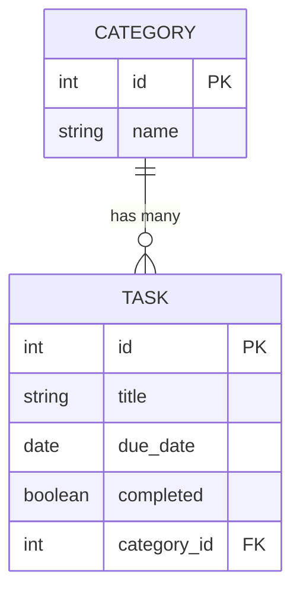

# Entity Relationship Diagram (ERD)

## Category and Task Models

## Model Descriptions

### Category
- **id**: Primary Key (Auto-increment)
- **name**: String field for category name

### Task
- **id**: Primary Key (Auto-increment)
- **title**: String field for task title
- **due_date**: Date field for task deadline
- **completed**: Boolean field to track completion status
- **category_id**: Foreign Key linking to Category model

## Relationship
One Category can have many Tasks (1:N relationship)
